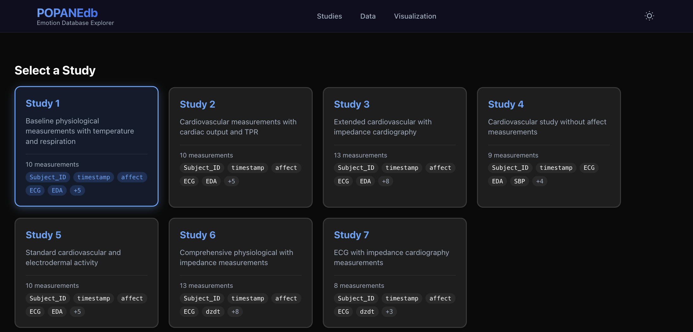
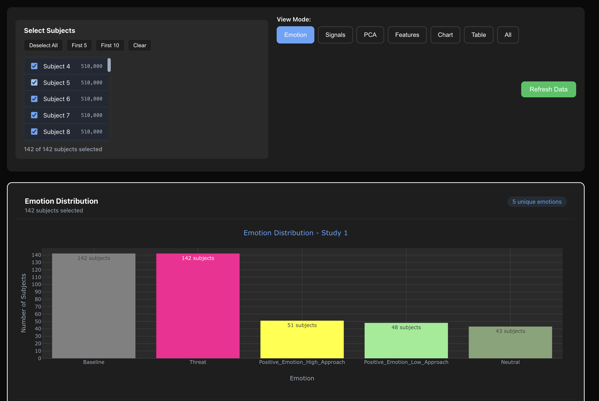
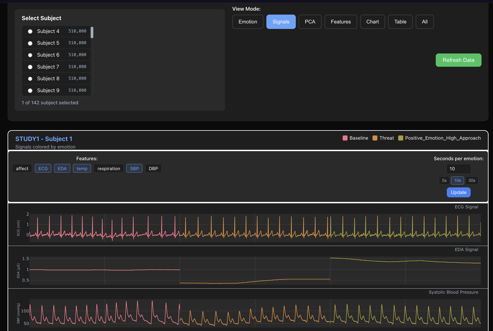
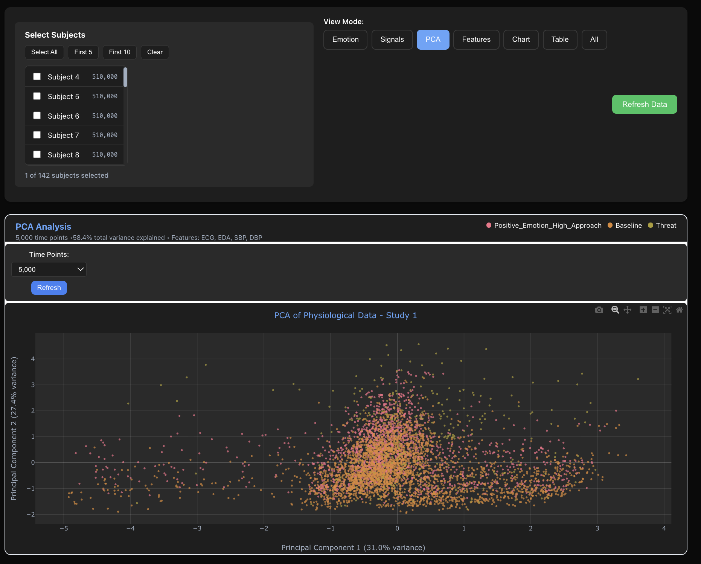
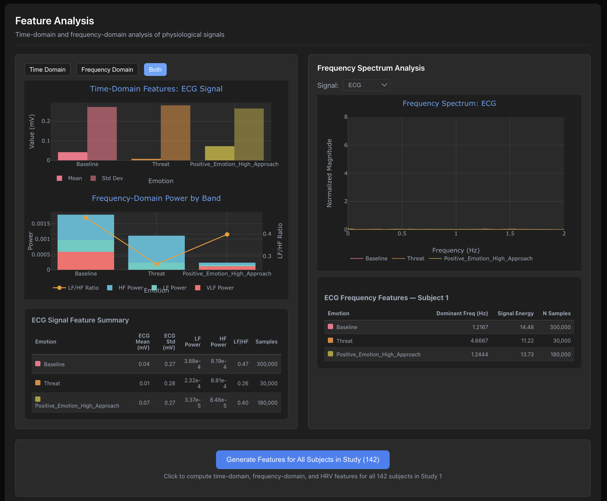
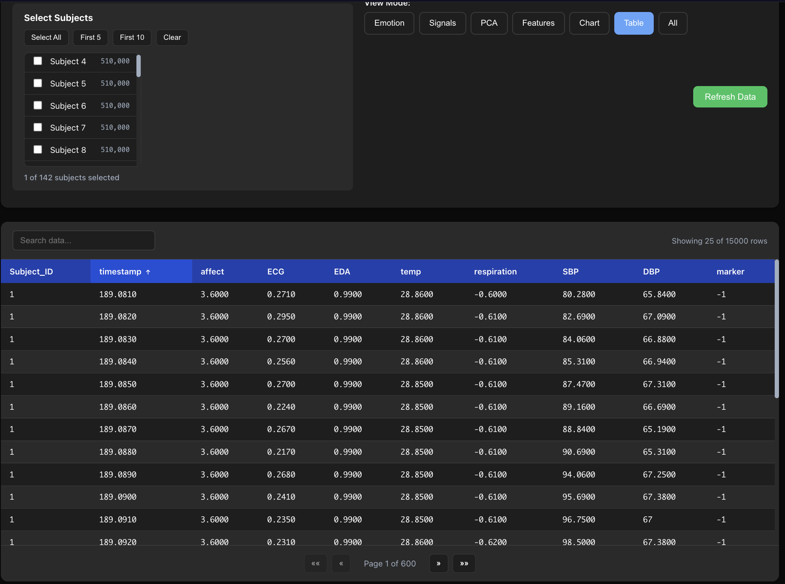

# POPANEdb Frontend

A React-based visualization dashboard for exploring physiological data from the POPANE (Physiological and Observational Pain Assessment in Neonates) database.

## Overview

POPANEdb Frontend provides interactive visualizations for analyzing multi-modal physiological signals across different emotional states. It connects to a FastAPI backend to fetch and display data from multiple studies.

## UI Screenshots:

### Study & Subject Selection


### Emotion Counts Across Subjects


### Emotion-Colored Physiological Signals


### PCA Visualization


### Time & Frequency Domain Feature Analysis


### Feature Matrix Table



## Features

- **Study & Subject Selection**: Browse studies and select individual or multiple subjects
- **Emotion Distribution**: Visualize emotion counts across subjects
- **Emotion-Colored Signals**: View physiological signals color-coded by emotional state
- **PCA Analysis**: Principal Component Analysis visualization for dimensionality reduction
- **Feature Analysis**: Time-domain and frequency-domain feature extraction
  - FFT-based frequency analysis
  - Comprehensive feature tables
  - PCA from engineered features
- **Interactive Charts**: Powered by Plotly.js with zoom, pan, and export capabilities
- **Dark/Light Theme**: Toggle between themes

## Tech Stack

- **React 19** with TypeScript
- **Plotly.js** for interactive visualizations
- **CSS** for styling (no UI framework)

## Project Structure

```
src/
├── components/
│   ├── charts/          # Visualization components
│   ├── common/          # Shared utilities (ErrorBoundary)
│   ├── layout/          # Header, InputBar
│   ├── selectors/       # Study/Subject selectors
│   └── ui/              # Button, Card, LoadingSpinner
├── context/             # Theme context
├── home/                # Main HomePage
├── hooks/               # Custom hooks
├── services/            # API service layer
└── types/               # TypeScript interfaces
```

## Getting Started

### Prerequisites

- Node.js 18+
- npm or yarn
- Running POPANEdb backend (default: `http://localhost:8000`)

### Installation

```bash
npm install
```

### Environment Variables

Create a `.env` file:

```

REACT_APP_VIZ_URL=http://localhost:8000/viz
REACT_APP_API_URL=http://localhost:8000/api
```

### Development

```bash
npm start
```

Opens [http://localhost:3000](http://localhost:3000)

### Production Build

```bash
npm run build
```

## Available Scripts

| Command | Description |
|---------|-------------|
| `npm start` | Run development server |
| `npm run build` | Build for production |
| `npm test` | Run tests |

## API Endpoints Used

- `GET /viz/studies` - List available studies
- `GET /viz/subjects/{study}` - Get subjects for a study
- `GET /viz/data/{study}` - Fetch study data
- `GET /viz/features/matrix/{study}` - Get feature matrix
- `GET /viz/pca/frequency/{study}` - Compute PCA on frequency features
- `GET /viz/fft/{study}/{subject}` - FFT analysis
